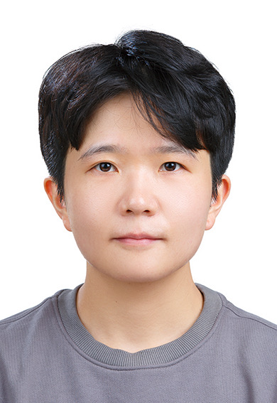

## 自我介绍

我叫李珏颖，目前就读于韩国建国大学计算机信息通信工程博士，专注于多智能体系统、智慧城市和分布式计算等方向的研究。我对人工智能、云计算、无人机数字孪生技术有浓厚兴趣，并在科研与实际项目中积累了丰富经验。  

在工作与学习中，我注重团队协作与问题解决，善于从复杂系统中发现优化空间。业余时间，我喜欢玩游戏、轮滑、摄影和音乐，这些爱好帮助我保持创造力和探索精神。

---

## 教育经历

- **韩国建国大学，计算机信息通信工程，博士**  
  韩国，首尔 | 2017.08 – 2025.02  
  主修课程：机器学习、多智能体系统、Smart City、分布式计算高级专题、分布式应用开发、移动通信、多媒体网络、智能物联网、软件建模、专业行业实践  

- **韩国建国大学，计算机信息通信工程，硕士**  
  韩国，首尔 | 2015.08 – 2017.08  
  主修课程：高级操作系统、网络体系结构、下一代系统、分布式信息系统、分布式应用开发、移动通信、虚拟现实高级专题、普适接口  

- **山东大学，软件工程，学士**  
  中国，山东 | 2010.09 – 2015.06  
  主修课程：C语言程序设计、数据结构与算法、操作系统、计算机网络、软件工程、数据库系统、Java程序设计  

---

## 实习经历

- **㈜Miryo-Vision公司，前后端开发工程师**  
  韩国，首尔 | 2018.07 – 2019.09  
  - 核心负责《服装生产数据管理系统》项目开发，基于 Spring Boot + Vue 技术栈，主导接口设计与数据交互模块开发，实现高效录入、精准统计与可视化。  
  - 优化前后端通信逻辑，制定标准化接口协议，提升数据处理效率与系统响应速度，改善用户体验。  
  - 运用 Docker/Kubernetes 完成多节点环境下部署，实现应用容器化管理与弹性扩展。  
  - 搭建 Prometheus + Grafana 运维监控平台，实时监控系统性能并进行告警，提高系统可用性与稳定性。  

---

## 项目经历

- **韩国建国大学航天航空研究所无人机数字孪生项目，研究员**  
  韩国，首尔 | 2021.10 – 至今  
  - 国家级十年重点项目，跨院系 30+ 人团队，聚焦无人机数字孪生研发。  
  - 设计 OpenStack 云架构，搭建航空航天仿真平台，支持复杂飞行仿真软件运行。  
  - 开发 FastAPI 服务端模块（飞机建模、交通模拟），优化计算逻辑，提升响应效率与稳定性。  
  - 使用 Ansible 实现平台资源自动化部署与弹性伸缩。  
  - 对接 Unreal Engine 3D 仿真环境，设计云端飞控逻辑与数据接口，支持虚拟飞机精准操控测试。  
  - 推动 CI/CD 流程落地，搭建自动化流水线，缩短迭代周期。  

- **智慧城市公共安全中的 LLM 与多智能体 AI 边云协同项目，研发员**  
  韩国，首尔 | 2022.10 – 2025.02  
  - 国家级五年政府立项项目，构建“边-云协同”多智能体 AI 系统，覆盖机器人巡检、老年人照护、应急响应。  
  - 设计 OpenStack 云架构与服务端，管理 50+ 台机器人，实现按区域动态分配计算资源，资源利用率提升 25%。  
  - 基于 Gazebo 与 ROS 搭建仿真环境，开发清扫路径规划（A* 优化）、障碍识别（YOLOv5）、健康提醒模块，完成 100+ 次仿真测试，功能准确率 92%+。  
  - 开发跌倒检测算法与紧急呼叫联动机制，通过云平台实时同步告警，响应时间 ≤ 1 分钟。  
  - 构建实时数据处理 Pipeline（Kafka + Spark Streaming），支撑峰值 1000+ 条/秒数据传输，系统稳定性提升 30%。  

- **面向 AI 信息服务的高性能混合云计算技术开发项目，研发员**  
  韩国，首尔 | 2016.12 – 2022.02  
  - 国家重点技术攻关项目，构建高性能混合云平台，为 AI 服务提供弹性计算与存储。  
  - 基于 FAI 工具改造部署流程，实现全流程自动化，部署时间从 3 天缩短至 4 小时，人工成本降低 80%。  
  - 搭建混合云平台（OpenStack+KVM/Xen+Ceph），支持 200+ 虚拟机并发运行，集成高可用机制。  
  - 开发虚拟机生命周期管理工具（创建、迁移、销毁），结合 Ansible/Terraform 实现资源自动化编排，资源利用率提升 45%。  
  - 平台服务累计 500+ 用户，运行稳定率 99.5%，成果形成 2 篇技术报告。  

---

## 专利

- **已授权专利**：유사성 판단 방법 및 그 장치 (METHOD FOR DETERMINING SIMILARITY AND APPARATUS USING THE SAME)  
  专利编号：10-2073686 | 授权日期：2020-01-30  

- **申请中专利**：컴포저블 가상머신 프로비저닝을 위한 마운팅 관리 장치 및 방법 (APPARATUS AND METHOD FOR COMPOSABLE VIRTUAL MACHINE PROVISIONING AND MOUNTING MANAGEMENT)  
  专利编号：10-2025-0041321 | 申请日期：2025-03-31  

---

## 论文与会议 Papers & Conferences

1. **Optimization of Character Animation Design and Motion Synthesis in Film and TV Media Based on Data Mining**  
Meng, Xiao, and **Jueying Li** | 2024  
[DOI: https://doi.org/10.14733/cadaps.2024.S19.245-259]  

2. **STaaS: Cost Effective and Scalable Union Mounting in ICP for Aerospace Applications**  
Sakthivel, V., **Li, J.**, Min, D., Lee, J. W., & Choi, E. | 2024  
Conference: 2024 International Conference on Green Energy, Computing and Sustainable Technology (GECOST), pp.334-338, IEEE  
[DOI: 10.1109/10474829](https://ieeexplore.ieee.org/stamp/stamp.jsp?tp=&arnumber=10474829)  

3. **Software aging effects on kubernetes in container orchestration systems for digital twin cloud infrastructures of urban air mobility**  
Costa, J., Matos, R., Araujo, J., **Li, J.**, Choi, E., Nguyen, T. A., … & Min, D. | 2023  
Journal: Drones, 7(1), 35
[DOI: https://doi.org/10.3390/drones7010035]  

5. **Auto-Provisioning of UAV Industry Cloud Platform for Intelligent Multi UAVs Simulation**  
**Li, Jueying**, et al. | 2023  
Conference: 15th International Conference on Advanced Computational Intelligence (ICACI), IEEE  
[DOI: https://ieeexplore.ieee.org/stamp/stamp.jsp?tp=&arnumber=10146139]

6. **Cloud-in-the-loop simulation: A cloud-based digital twin HW/SW framework for multi-mode AI control simulation of eVTOL KADA-UAM Personal Aerial Vehicles**  
Nguyen, T. A., **Li**, J., Jang, M., Maw, A. A., Pham, V., & Lee, J. W. | 2022  
Conference: 한국항공우주학회 학술발표회 초록집, pp.138-139
[DOI: https://www.dbpia.co.kr/Journal/articleDetail?nodeId=NODE11076743]  

8. **UAV Oriented Container based Reconfigurable Federated Fog/Edge Cluster System**  
**Li, Jueying**, et al. | 2023  
Conference: 한국항공우주학회 학술발표회 초록집, pp.566-567  
[DOI: https://www.dbpia.co.kr/journal/articleDetail?nodeId=NODE11439244]

10. **Customer Feedback Automation and Classification using Sentiment Analysis, Robotic Process Automation and UiPath**  
Sakthivel Velusamy, Varshini Ganti, Nethra Sai M, Deepthi Ramesh, Vishnu Kumar Kaliappan, **Jueying Li** | 2023  
Conference: International Conference on Recent Trends in Data Science and its Applications (ICRTDA 2023)  
[DOI: 10.13052/rp-9788770040723.175](https://doi.org/10.13052/rp-9788770040723.175)  

11. **System Dynamics Model of Urban Transportation System**  
2024  
Book: Urban Air Mobility, pp.53-74  
[DOI: 10.1201/9781003339953-3](https://www.taylorfrancis.com/books/mono/10.1201/9781003339953-3)  

---

## 游戏经历

- **二次元开放世界 RPG — 《原神》**  
  - 大世界等级 60 级，累计游戏 7700 小时，熟练掌握副本机制与阵容搭配。  
  - 分析数值成长体系、抽卡经济系统、角色定位策略及玩家付费心理。  

- **回合制 RPG — 《崩坏：星穹铁道》《梦幻西游》**  
  - 深度体验角色养成与战斗机制，熟悉 PVE/PVP，理解数值循环与长期运营策略。  

- **动作类 RPG — 《绝区零》《DNF》**  
  - 熟悉职业玩法、副本机制、技能连招设计，理解动作类游戏手感与关卡节奏。  

- **MOBA / 竞技类 — 《王者荣耀》**  
  - 十年游戏经验，单排王者段位，熟悉英雄技能、战术配合、职业赛策略。  

- **FPS / 竞技射击 — 《无畏契约》《和平精英》**  
  - 熟悉枪械数值、战术执行与团队协作，理解节奏与资源分配对玩家体验的影响。  

- **经典单机 RPG — 《海港物语》《房产达人》**  
  - 沉浸式经营玩法体验，理解资源管理、经济循环及用户粘性设计。  

- **怪物收集/成长 — 《Monster Hunter》《宝可梦》**  
  - 完整体验收集、培养与战斗体系，分析成长曲线对玩家行为的影响。  

- **开放世界冒险 — 《塞尔达传说：旷野之息》《王国之泪》**  
  - 多次复玩，完成 100% 地图探索与内容体验，理解沙盒玩法核心逻辑。  

---

## 语言 & 技能

- **语言**：中文（母语）、英文（精通，CET-4/6）、韩语（精通，TOPIK5，C1）  
- **技能**：Microsoft Office、OpenStack、KVM、libvirt、Ceph、Xen、FAI、Kubernetes、Docker、PyTorch、TensorFlow、LLM、Terraform、Ansible、UnrealEngine、PX4、QGroundControl  

---

## 爱好

- 游戏、轮滑、摄影、音乐、运动
